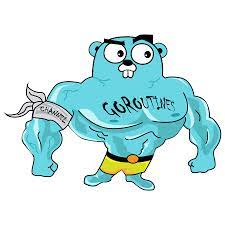
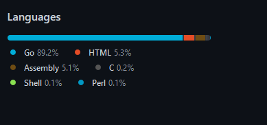

# Caracterização linguagem golang

[](https://go.dev/)

## Aspectos gerais

Go é uma linguagem compilada e estaticamente tipada desenvolvida pelo Google e criada por [Robert Griesemer](https://en.wikipedia.org/wiki/Robert_Griesemer_(computer_programmer)), [Rob Pike](https://en.wikipedia.org/wiki/Rob_Pike) e [Ken Thompson](https://en.wikipedia.org/wiki/Ken_Thompson).

Go possui uma certa similaridade com o C (tanto sintática como em algumas features como por exemplo controle de ponteiros), mas também possui caracteristicas como segurança de memória (memory safety), garbage collection, structural typing e suporte a concorrencia no estilo [CSP](https://en.wikipedia.org/wiki/Communicating_sequential_processes).

---

## Atributos de qualidade

---

### Legibilidade

A go lang possuí uma sintaxe muito comum ao C como poder ser visto nos exemplos abaixos:

```c
// Programa escrito em c
#include<stdio.h>

int main(void) {
  println("Hello world\n");
  return 0;
}
```

```go
// Programa escrito em golang

package main

import "fmt"

func main() {
  fmt.PrintLn("Hello world\n")
}
```

Apesar das semelhanças sintáticas a golang possui um padrão sintático bem  particular
onde o case da primeira letra do identificador da variável/função/struct dita a visibilidade do mesmo por exemplo:

```go
package timer

import "time"

// A StopWatch is a simple clock utility.
// Its zero value is an idle clock with 0 total time.
type StopWatch struct {
    start   time.Time
    total   time.Duration
    running bool
}

// Start turns the clock on.
func (s *StopWatch) Start() {
    if !s.running {
        s.start = time.Now()
        s.running = true
    }
}
```

Onde a struct StopWatch e o método Start ligado a ela são públicos mas os atributos da struct não, pois começam respectivamente com a primeira letra maiúscula  (indicando que a visibilidade fora do pacote é pública)  e minúscula (indicando que a visibilidade fora do pacote é privada).

```go
package main

import "timer"

func main() {
    clock := new(timer.StopWatch)
    clock.Start()
    if clock.running { // ILLEGAL
        // …
    }
}

/**  Invocar método de visibilidade privada fora do pacote gera a seguinte exceção: ../main.go:8:15: clock.running undefined (cannot refer to unexported field or method clock.running) */
```

---

### Simplicidade

Go é uma linguagem extremamente simples e rápida de se aprenter uma vez que ela é extremamente enxuta (possuindo apenas 25 palavras reservadas), e possui uma sintaxe bem natural.

---

### Ortogonalidade

Para conseguir a  ortogonalidade, a  Golang é guiada pelos seguintes principios de design:

+ Faça uma coisa bem
+ Mantenha as coisas simples
+ Tenha uma maneira padrão de comunicação

O príncipio de  se fazer uma coisa bem (análogo ao simple responsability pattern na engenharia de software) pode ser percebido ao repararmos que o core da golang (a standard library) é orgazinado em pequenos pacotes onde cada um deles possui uma tarefa especifica e a faz muito bem, um exemplo de pacote que segue essa filosofia de design é o pacote de [http](godoc.org/net/http).

O principio de se fazer as coisas de maneira simples pode ser percebido ao analisarmos que go possui um conjunto extremamente enxuto de palavras reservadas (apenas 25) e que os módulos interno da linguagem nada mais são do que conjuntos de [struct](https://www.geeksforgeeks.org/structures-in-golang/), funções e variáveis aproveitando o próprio vocabulário da linguagem.

[](https://github.com/golang/go)

Já o principio de se manter uma maneira padronizada de se comunicar de maneira padronizada (uniforme) entre os módulos é alcançada por meio da definição de [interfaces](https://go.dev/doc/effective_go#interfaces), que servem para definir o comportamento de um objeto, especificando o que ele pode fazer exemplo:

```go
type clients []string

func (c *clients) AddClient(s string): bool {
  /** adds client*/
}

func (c clients) IsAdded(s string): bool {
  /** returns a client **/
}
```

O código acima define as operações operações que podem ser implementadas pelo tipo clients

Outro exemplo de definição de interface é

---

### Estruturas de controle

Na linguagem de programação go existem três tipo de estrutura de controle que são:

#### Estruturas de controle sequencial

#### Estruturas de controle lógico

Nessa categoria encontramos estruturas que alteram o fluxo da aplicação baseado em condições lógicas, dentro dessa categoria na golang temos as instruções *if* *switch* else *else*.

Exemplo:

```go
/** switch example */
package main
import "fmt"

func choise(option int) {
  switch(option) {
    case 1:
      fmt.Println("One")
    case 2:
      fmt.Println("Two")
    case 3:
      fmt.Println("Three")
    default:
      fmt.Println("Invalid option")
  }

}

func main() {
  i := 1
  choise(i)
}

```

```go

/** If example  */
package main

import "fmt"

func verify(age int) {
 if age >= 18 {
  fmt.Println("Legal age")
 } else {
  fmt.Println("Minor")
 }
}

func main() {
 var age int
 fmt.Scanf("%d", &age)
 verify(age)
}
```

### Estruturas de controle iterativo

Dentro deste tipo de categoria diferente de outras linguagens de programação que possuem outros tipos de laços como por exemplo: *while* e *do while* na golang nós temos o laço iterativo condicional *for*.

```go

package main

import (
  "fmt"
)

func main() {

  /**
    for example written in go
  */
  for i:= 3; i>0; i-- {
    fmt.Println(i)
  }

  /** 
    "While (true)" equivalent written in go
  */
  
  var x int
  for true {
    fmt.Println("Dummy example")
    fmt.Scanf("%d", &x)
    if x == 1 {
      break
    }
  }
}

```

---

## Estruturas e tipos de dados

### Tipos de dados

Tipos de dados especificam o que uma variável válida em go pode armazenar, podemos subdividr os tipos de dados presentes na linguagem golang em 4 tipos:

<table style="border: 1px solid black">
  <tr>
    <td> Nome: </td>
    <td> Descrição: </td>
  </tr>
    <tr>
      <td> Tipos primitivos </td>
      <td> Números, String e booleanos </td>
    </tr>
    <tr>
      <td> Tipos Agregados </td>
      <td> Array e <a href="https://www.geeksforgeeks.org/structures-in-golang/">Estruturas</a> </td>
    </tr>
    <tr>
      <td> Tipos de referência </td>
      <td> Ponteiros, slicers, maps, funções e channels </td>
    </tr>
    <tr>
      <td> Tipos de interfaces</td>
      <td> </td>
    </tr>
</table>

---

### Números

Inteiros (Integers):  Na linguagem Go, ambos os números positivos e negativos estão disponíveis, onde um inteiro com sinal é representado por um int e um inteiro sem sinal é representado por uint

<table style="border: 1px solid black">
<tr>
  <td> Tipo: </td>
  <td> Descrição </td>
</tr>
<tr>
  <td> int8 </td>
  <td> Inteiro de 8 bit com sinal</td>
</tr>
<tr>
  <td> int16 </td>
  <td> Inteiro de 16 bit com sinal</td>
</tr>
<tr>
  <td> int64 </td>
  <td> Inteiro de 16 bit com sinal </td>
</tr>
<tr>
  <td> uint8 </td>
  <td> Inteiro de 8 bit sem sinal (positivo) </td>
</tr>
<tr>
  <td> uint16 </td>
  <td> Inteiro de 16 bit sem sinal </td>
</tr>
<tr>
  <td> uint32 </td>
  <td> Inteiro de 32 bit sem sinal </td>
</tr>
<tr>
  <td> uint64 </td>
  <td> Inteiro de 64 bit sem sinal </td>
</tr>
<tr>
  <td> int </td>
  <td> Inteiro que possui 32 ou 64 bit </td>
</tr>
<tr>
  <td> uint </td>
  <td> Inteiro sem sinal que possui 32 ou 64 bit</td>
</tr>
<tr>
  <td> rune </td>
  <td> Sinonimo de int32 </td>
</tr>
<tr>
  <td> byte </td>
  <td> sinonimo de int8 </td>
</tr>
<tr>
  <td> uintptr </td>
  <td> inteiro sem sinal com tamanho indefinido, mas pode armazenar todos os bits de um valor de um ponteiro </td>
</tr>
</table>

---

Números de ponto flutuante:  Na linguagem go, números de ponto flutuante são divididos em duas categorias conforme mostrado abaixo

<table style="border: 1px solid black">
<tr>
  <td>Tipo:</td>
  <td> Descrição: </td>
</tr>
<tr>
  <td> complex64 </td>
  <td>
    Ambas as partes real e a imaginária possuem 32 bit
  </td>
</tr>
<tr>
  <td> complex128 </td>
  <td>
    Ambas as partes real e imaginária possuem 64 bits
  </td>
</tr>
</table>

<table style="border: 1px solid black">
<tr>
  <td>Tipo:</td>
  <td> Descrição: </td>
</tr>
<tr>
  <td> float32 </td>
  <td> Número de ponto flutuante de 32 bit no padrão IEEE 754 </td>
</tr>
<tr>
  <td> float64 </td>
  <td> Número de ponto flutuante de 64 bit no padrão IEEE 754 </td>
</tr>
</table>

---

#### Booleanos

Podem assumir os valores true ou false

---

## Estruturas

Diferente de linguagens de programação orientadas a objeto a golang adota uma feature bem similar ao **c** para criação de tipos abstratos de dados mais complexo, e o nome dessa feature é [structs](https://www.geeksforgeeks.org/structures-in-golang/).

Por meio da utilização de structs podemos criar tipos compostos de objetos como por exemplo:

```go
/** Exemplo de struct em Go */
type Person struct {
  string name
  int age
}

```

```c
/** Exemplo de struct em c */
typedef struct Person {
  char[] name;
  int age;
} tPerson;
```

Apesa da similaridade entre as structs em c e as structs em go há uma diferença fundamental entre elas, que é que structs podem ter metódos em go enquanto em c não, exemplo:

```go
/** 
* Neste exemplo temos uma struct "People"
* Que tem como metódo o addPerson 
*/
package main

import "fmt"

type Person struct {
  name string
  age int
}


type People struct {
  group []Person
}

func CreatePeople() *People{
  return &People{}
}

func (p *People) addPerson(name string, age int) Person {
  person := Person{name: name, age: age}
  p.group = append(p.group, person)
  return person
}

func main() {
  p := CreatePeople()
  p.addPerson("joao", 19)  
  fmt.Println(p.group)
  p.addPerson("Homer", 22)
  fmt.Println(p.group)
}
```

---

## Aspectos sintáticos


